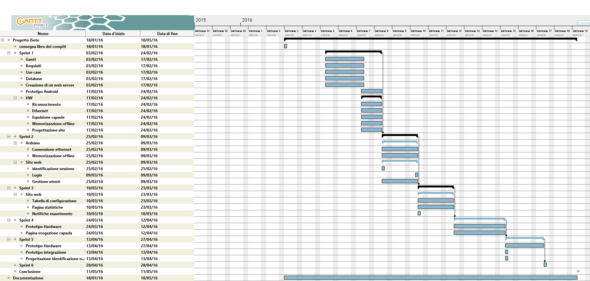
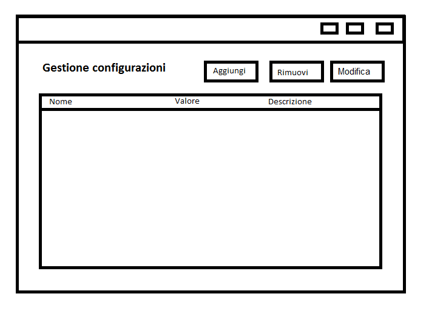
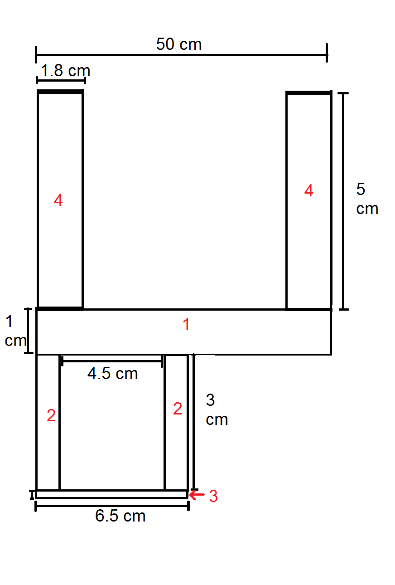

# iSete


1. [Introduzione](#introduzione)

  - [Informazioni sul progetto](#informazioni-sul-progetto)

  - [Abstract](#abstract)

  - [Scopo](#scopo)

1. [Analisi](#analisi)

  - [Analisi del dominio](#analisi-del-dominio)

  - [Analisi e specifica dei requisiti](#analisi-e-specifica-dei-requisiti)

  - [Analisi e specifica dei requisiti](#analisi-e-specifica-dei-requisiti)

1. [Use case](#use-case)

  - [Pianificazione](#pianificazione)

  - [Analisi dei mezzi](#analisi-dei-mezzi)

1. [Progettazione](#progettazione)

  - [Design dell’architettura del sistema](#design-dell’architettura-del-sistema)

  - [Design dei dati e database](#design-dei-dati-e-database)

  - [Design delle interfacce](#design-delle-interfacce)

  - [Design procedurale](#design-procedurale)

1. [Implementazione](#implementazione)

1. [Test](#test)

  - [Protocollo di test](#protocollo-di-test)

  - [Risultati test](#risultati-test)

  - [Mancanze/limitazioni conosciute](#mancanze/limitazioni-conosciute)

1. [Consuntivo](#consuntivo)

1. [Conclusioni](#conclusioni)

  - [Sviluppi futuri](#sviluppi-futuri)

  - [Considerazioni personali](#considerazioni-personali)

1. [Bibliografia](#bibliografia)

  - [Bibliografia per articoli di riviste](#bibliografia-per-articoli-di-riviste)

  - [Bibliografia per libri](#bibliografia-per-libri)

  - [Sitografia](#sitografia)

1. [Allegati](#allegati)


## Introduzione

### Informazioni sul progetto


  Scuola: SAMT - Scuola Arti e Mestieri Trevano
  Sezione: Informatica
  Matera: Progetti

  Allievi:
  - Ettore Ongaro
  - Andrea Lupica
  - Raffaele Scarcella
  - Nishan Anthonippillai
  - Serhiy Ushchapivskyy

Docente responsabile
  - Luca Muggiasca

Data di inizio: 03.02.2016

Data di consegna: 11.05.2016

<!--

  In questo capitolo raccogliere le informazioni relative al progetto, ad esempio:

  -   Allievo/i e docente/i coinvolti nel progetto e rispettivi ruoli,

  -   scuola ,sezione, materia/e,

  -   date di inizio e termine di consegna,

  -   …
  -->


### Abstract

<!--

  E’ una breve e accurata rappresentazione dei contenuti di un documento,
  senza notazioni critiche o valutazioni. Lo scopo di un abstract efficace
  dovrebbe essere quello di far conoscere all’utente il contenuto di base
  di un documento e metterlo nella condizione di decidere se risponde ai
  suoi interessi e se è opportuno il ricorso al documento originale.

  Può contenere alcuni o tutti gli elementi seguenti:

  -   **Background/Situazione iniziale**

  -   **Descrizione del problema e motivazione**: Che problema ho cercato
      di risolvere? Questa sezione dovrebbe includere l'importanza del
      vostro lavoro, la difficoltà dell'area e l'effetto che potrebbe
      avere se portato a termine con successo.

  -   **Approccio/Metodi**: Come ho ottenuto dei progressi? Come ho
      risolto il problema (tecniche…)? Quale è stata l’entità del mio
      lavoro? Che fattori importanti controllo, ignoro o misuro?

  -   **Risultati**: Quale è la risposta? Quali sono i risultati? Quanto è
      più veloce, più sicuro, più economico o in qualche altro aspetto
      migliore di altri prodotti/soluzioni?

  Esempio di abstract:

  > *As the size and complexity of today’s most modern computer chips
  > increase, new techniques must be developed to effectively design and
  > create Very Large Scale Integration chips quickly. For this project, a
  > new type of hardware compiler is created. This hardware compiler will
  > read a C++ program, and physically design a suitable microprocessor
  > intended for running that specific program. With this new and powerful
  > compiler, it is possible to design anything from a small adder, to a
  > microprocessor with millions of transistors. Designing new computer
  > chips, such as the Pentium 4, can require dozens of engineers and
  > months of time. With the help of this compiler, a single person could
  > design such a large-scale microprocessor in just weeks.*

-->
_Do you need a coffee but you don't have with for buy it? Don't worry: with the new dispenser you can buy every type of coffee pod trought your account!
You just have to log in, add your credit to your account and you can buy coffee pod when you want, everywhere you are.
With the new dispenser you could buy coffee pod from your phone without go to the coffe maker !
What are you waiting for? Take your preferred coffee pod!_

### Scopo

<!--
  Lo scopo del progetto (scopi didattici/scopi operativi). Dovrebbe
  descrivere il mandato, ma non vanno ricopiate le informazioni del
  quaderno dei compiti (che va invece allegato).
-->
  Lo scopo principale del progetto è quello di realizzare un sistema di
  gestione e acquisto per le capsule del caffé.

  Questo sistema viene utilizzato principalmente da tre tipologie di utenti:
  - Amministratore: ha il pieno controllo del sistema
  - Responsabile: si occupa della gestione dei crediti e degli utenti
  - Utente generico: acquista le capsule e consulta il suo credito e storico
    degli acquisti

Vi è un sito del prodotto dove il cliente tramite la postazione fisica oppure
tramite un applicazione android può acquistare le capsule.
Il responsabile si collega al sito per visualizzare statistiche riguardanti
utenti e capsule e ricaricare il saldo.

<!-- sezione non finita -->

## Analisi

### Analisi del dominio

<!--
  Questo capitolo dovrebbe descrivere il contesto in cui il prodotto verrà
  utilizzato, da questa analisi dovrebbero scaturire le risposte a quesiti
  quali ad esempio:

  -   Background/Situazione iniziale

  -   Quale è e come è organizzato il contesto in cui il prodotto dovrà
      funzionare?

  -   Come viene risolto attualmente il problema? Esiste già un prodotto
      simile?

  -   Chi sono gli utenti? Che bisogni hanno? Come e dove lavorano?

  -   Che competenze/conoscenze/cultura posseggono gli utenti in relazione
      con il problema?

  -   Esistono convenzioni/standard applicati nel dominio?

  -   Che conoscenze teoriche bisogna avere/acquisire per poter operare
      efficacemente nel dominio?

  -   …
-->
Al momento coloro che usufruiscono della macchinetta del caffé sono solo i docenti.
Non esiste nulla di simile al momento, chi vuole usare la macchinetta del caffé deve comprarsi le proprie capsule.
Per utilizzare questo prodotto non bisogna avere competenze particolari.


### Analisi e specifica dei requisiti


|ID |REQ-001                                       |
|---|------------------------------------------------|
|**Nome**    |Struttura hardware |
|**Priorità**|1                     |
|**Versione**|1.0                   |
|            |**Sotto requisiti** |
|**001**      | 	Deve essere modulabile.  |
|**002**      | Deve essere riempito con le capsule.|
|**003**      |Il ricaricamento deve essere facilitato, senza compromettere il funzionamento della struttura.                  |
|**004**      |Deve avere un metodo di espulsione delle capsule a dipendenza della scelta effettuata.|
|**005**      |Notificare il responsabile della mancanza delle capsule.|
|**006**      |Deve comunicare al server gli acquisti.|
|**007**      |Le capsule devono essere gestite da un servomotore controllato dall’Arduino.|


|ID |REQ-002                                       |
|---|------------------------------------------------|
|**Nome**    |Riconoscimento |
|**Priorità**|1                     |
|**Versione**|1.0                   |
|            |**Sotto requisiti** |
|**001**      | 	Deve essere presente un metodo di riconoscimento univoco dell’utente, che vuole usufruire dell’apparecchio.  |
|**002**      | Bisogna avere una server dove memorizzare gli utenti.|
|**003**      |In caso di server down, bisogna avere un riconoscimento locale.                 |
|**004**      |In caso di server down, bisogna avere un metodo di memorizzazione temporaneo in locale.|

|ID |REQ-003                                       |
|---|--------------------------------------------------------|
|**Nome**    |Amministratore |
|**Priorità**|1                     |
|**Versione**|1.0                   |
|            |**Sotto requisiti** |
|**001**      | 	Amministratore gestisce il sito.  |
|**002**      | Deve poter dare permessi.|
|**003**      |Deve poter aggiungere i moduli.        |

|ID |REQ-004                                       |
|---|------------------------------------------------|
|**Nome**    |Responsabile |
|**Priorità**|1                     |
|**Versione**|1.0                   |
|            |**Sotto requisiti** |
|**001**      | 	Si preoccupa della gestione dei crediti di ogni singolo utente.  |
|**002**      | Ricaricare il distributore di capsule. |
|**003**      |Avere la possibilità di creare utenti.    |
|**004**      |Deve poter gestire gli utenti.|
|**005**      |Deve poter creare i grafici dei acquisti.|
|**006**      |Deve poter caricare credito agli utenti.|
|**007**      |Dovrà avere la possibilità di vedere le capsule vendute.|

|ID |REQ-005                                      |
|---|--------------------------------------------------------|
|**Nome**    |Utente comune |
|**Priorità**|1                     |
|**Versione**|1.0                   |
|            |**Sotto requisiti** |
|**001**      | 	Ogni utente deve poter consultare il proprio credito.  |
|**002**      | Ha a disposizione informazioni riguardanti i propri acquisti quali storico e quantità di capsule.|

|ID |REQ-006                                     |
|---|--------------------------------------------------------|
|**Nome**    |Utente comune |
|**Priorità**|1                     |
|**Versione**|1.0                   |
|            |**Sotto requisiti** |
|**001**      | Gestione credito dei utenti dal responsabile. |
|**002**      | Ordinare le capsule dal utente.|
|**003**      |Gestione intero sistema dall’amministratore.  |

### Use case


### Pianificazione
<!--
Prima di stabilire una pianificazione bisogna avere almeno una vaga idea
del modello di sviluppo che si intende adottare. In questa sezione
bisognerà inserire il modello concettuale di sviluppo che si seguirà
durante il progetto. Gli elementi di riferimento per una buona
pianificazione derivano da una scomposizione top-down della problematica
del progetto.

La pianificazione può essere rappresentata mediante un diagramma di
Gantt.

Se si usano altri metodi di pianificazione (es scrum), dovranno apparire
in questo capitolo.
-->
### Analisi dei mezzi
<!--
Elencare e *descrivere* i mezzi disponibili per la realizzazione del
progetto. Ricordarsi di sempre descrivere nel dettaglio le versioni e il
modello di riferimento.

SDK, librerie, tools utilizzati per la realizzazione del progetto e
eventuali dipendenze.

Su quale piattaforma dovrà essere eseguito il prodotto? Che hardware
particolare è coinvolto nel progetto? Che particolarità e limitazioni
presenta? Che hw sarà disponibile durante lo sviluppo?
-->
#### Software
- Apache 2.4.10
- MySQL 5.5.44-0+deb8u1
- PHP 5.6.17-0+deb8u1
- Android Studio 2.0
- Raspbian 8.0
- API Google Chart
- Bootstrap 3.3.6
- JQuery 1.12.0
- JDK Java 1.8.0_65

#### Hardware

## Progettazione
<!--
Questo capitolo descrive esaustivamente come deve essere realizzato il
prodotto fin nei suoi dettagli. Una buona progettazione permette
all’esecutore di evitare fraintendimenti e imprecisioni
nell’implementazione del prodotto.
-->

### Design dell’architettura del sistema
<!--
Descrive:

-   La struttura del programma/sistema lo schema di rete...

-   Gli oggetti/moduli/componenti che lo compongono.

-   I flussi di informazione in ingresso ed in uscita e le
    relative elaborazioni. Può utilizzare *diagrammi di flusso dei
    dati* (DFD).

-   Eventuale sitemap
-->
### Design dei dati e database
<!--
Descrizione delle strutture di dati utilizzate dal programma in base
agli attributi e le relazioni degli oggetti in uso.
-->
### Schema E-R, schema logico e descrizione.
<!--
Se il diagramma E-R viene modificato, sulla doc dovrà apparire l’ultima
versione, mentre le vecchie saranno sui diari.
-->


### Design delle interfacce
<!--
Descrizione delle interfacce interne ed esterne del sistema e
dell’interfaccia utente. La progettazione delle interfacce è basata
sulle informazioni ricavate durante la fase di analisi e realizzata
tramite mockups.
-->
### Design procedurale
<!--
Descrive i concetti dettagliati dell’architettura/sviluppo utilizzando
ad esempio:

-   Diagrammi di flusso e Nassi.

-   Tabelle.

-   Classi e metodi.

-   Tabelle di routing

-   Diritti di accesso a condivisioni …

Questi documenti permetteranno di rappresentare i dettagli procedurali
per la realizzazione del prodotto.
-->
### Web Server

#### Sitoweb

##### Login(Ettore & Usha)

La pagina di login, dovrebbe diventare qualcosa di simile
all'immagine sottostante.


Da cui si accede, poi, a dipendenza dell'utente, ad una pagina differente (richiesta o configurazione).

##### Richiesta (Ettore & Usha)
La pagina richiesta abbiamo deciso di farla in questo modo

<!-- da terminare -->


##### Pagina di configurazione(Raffaele)

Ho pensato di fare la pagina di configurazione nel seguente modo:

un titolo in alto alla pagina, una tabella centrale che contiene i record
della tabella di configurazione e due bottoni rispettivamente per aggiungere o
rimuovere record.




##### Pagina Statistiche (Raffaele)
Per quanto riguarda la pagina di statistiche per il responsabile ho pensato
di svilupparla con un titolo in alto, con delle tabelle contenenti delle
statistiche che in seguito vengono rappresentati attraverso dei grafici.


##### Gestione utenti(Nishan)
Ho progettato una pagina molto semplice con una tabella chiara con le informazioni neccessarie e inserito anche dei campi per gestire la tabella.

All'inizio della pagina chiedo le informazione base per aggiungere utenti e rimuoverli.

Per aggiungere un utente chiedo di inserire nome, cognome, credito e password. Deve essere obbligatorio mettere tutti i dati. Per rimuovere l'utente basta inserire nome e cognome.


##### Storico acquisti(Nishan)
Ho progettato una pagina molto semplice con una tabella chiara con le informazioni neccessarie.

Questa pagina è visible solamente agli utenti che sono registrati e tramite la connesione al database faccio vedere
tutti gli acquisti.


#### Applicazione Android(Raffaele)
L'applicazione Android ho pensato di farla semplicemente tramite una
webview permettendo così di utilizzare unicamente il sito e renderlo responsive
su qualunque smartphone android.

### HW

#### Gestione (Andrea & Serhiy)
Per la memorizzazione offline e il collegamento ethernet abbiamo inizialmente deciso di usare Arduino, ma a causa di troppi problemi riscontrati abbiamo deciso di usare Raspberry. Abbiamo deciso di fare uno codice in java che, a dipendenza di quante capsule venivano scelte, faceva girare il servo motore n volte.

#### Struttura (Nishan & Raffaele)
Per la struttura abbiamo pensato ad una superificie da attaccare al muro sulla quale posizionare dei separatori per le capsule.
Le capsule saranno visibili poichè si collegeranno i separatori con del plexiglass.


Uno schizzo fatto alla lavagna con qualche misura annotata.


Progettazione dall'alto del dispenser con misure più nel dettaglio:

- 1) Materiale che andrà attaccato alla parete.
Dimensioni: 6.5x30x1 centimetri.
- 2) Materiale che avrà la funziona di separatore tra le diverse colonne di capsule.
Dimensioni: 1x25x3 centimetri in modo da contenere una decina di capsule e avere lo spazio per creare un'unica via d'uscita.
- 3) Plexiglass per fare in modo di poter vedere le capsule all'interno del dispenser.
Dimensioni: 6.5x25x0.3 centimetri per poter ricoprire tutta la lunghezza dei separatori.


Per permettere di collegare i componenti al Raspberry applicheremo dei supporti per tenere la base leggermente distante dal muro.


Per quanto riguarda la posizione dei servo motori praticheremo dei fori alla base dove inserirceli dentro.


#### Espulsione capsule (Nishan & Raffaele)
Per quanto riguarda l'espulsione delle capsule abbiamo pensato di far ruotare le capsule usando il metodo a ferro di cavallo.

Il servo motore avrà attaccata un'elica che a sua volta sarà collegata al "ferro di cavallo" per farlo girare.
Con questo metodo si riesce a prendere una capsula alla volta, poichè grazie alla rotazione del contenitore si chiude lo spazio per una seconda capsula.


#### Memorizzazione offline

#### Collegamento ethernet


## Implementazione

<!--
In questo capitolo dovrà essere mostrato come è stato realizzato il
lavoro. Questa parte può differenziarsi dalla progettazione in quanto il
risultato ottenuto non per forza può essere come era stato progettato.

Sulla base di queste informazioni il lavoro svolto dovrà essere
riproducibile.

In questa parte è richiesto l’inserimento di codice sorgente/print
screen di maschere solamente per quei passaggi particolarmente
significativi e/o critici.

Inoltre dovranno essere descritte eventuali varianti di soluzione o
scelte di prodotti con motivazione delle scelte.

Non deve apparire nessuna forma di guida d’uso di librerie o di
componenti utilizzati. Eventualmente questa va allegata.

Per eventuali dettagli si possono inserire riferimenti ai diari.
-->


### Web Server

#### Sitoweb

##### Gestione utenti (Nishan)
###### Aggiungi utente
Per svolgere questa pagina ho usato Boostrap.
Il per chiedere il credito ho inserto un campo per soli numeri, per la mail ho usato una funzione di controllo che ha usato Ettore per il login. Quando si inserisce la password e le inserisco nel database le codifico con la una funzione che si chiama .md5. Poi tramite una funzione controllo se le due password sono uguali.
```
function controllo(modulo){
    if (modulo.password.value != modulo.ripeti.value) {
		alert("La password inserita non coincide con la prima!")
		modulo.password.focus()
		modulo.password.select()
		return false
	  }
	  return true
	}
  ```
C'è anche in controllo che obbliga a inserire tutti i campi.
```
if(!empty($nome) && !empty($cognome) && !empty($credito) && !empty($password)){
  ```
  Con questo if controllo se tutti i campi sono completati.


###### Rimuovi utente
Per rimuovere un utente basta inserire l'email dell'utente visto che lo abbiamo messo primary key quindi vado a cancellare quell'utente con la mail specificata in precedenza.


Mi è stato richiesto di inserire un tasto che riporta l'utnete sulla pagina del proprio profilo. Per questo ho deciso di usare un file css dove specifico dove deve rimanere
```
#back{
position:fixed;
top:0;
left:0;
}
```


##### Gestione credito (Nishan)
Con questo modulo posso gestire il credito massimo che si puo avere. Poi come detto in precedenza, quando inserisco un nuovo utente controllo che il credito iniziale sia minore uguale al massimo.


##### Storico utente (Nishan)
Questa pagina mostra le capsule prese dall'utente. Quando l'utente accede prendo il nome utente e uso quello per mostrare lo storico.


##### Login(Ettore)

##### Sezione configurazione(Raffaele)

La sezione è configurata in modo da avere una tabella centrale con sopra tre bottoni per le funzionalità: aggiungi, rimuovi e modifica.


La tabella è strutturata nel seguente modo:
```
<?php while($row = sess("db")->fetch($tmp)){ ?>
	<tr>
		<td><?php echo $row["co_nome"];?></td>
		<td><?php echo $row["co_valore"];?></td>
		<td><?php echo $row["co_descrizione"];?></td>
	</tr>
<?php }
```

###### Aggiungi configurazione

Quando si clicca il bottone "Aggiungi configurazione" uscirà un popup in cui viene richiesto il nome, il valore e una descrizione.


Una volta confermata l'aggiunta, il sito si reindirizza ad un'altra pagina che aggiunge la configurazione al database:
```
$nome = $_POST['nome'];
$valore = $_POST['valore'];
$descrizione = $_POST['descrizione'];
sess("db")->start();
if(!empty($nome) && !empty($valore)){
	$ret = sess("db")->query("INSERT INTO configurazione (co_nome, co_valore, co_descrizione) VALUES ('".$nome."', '".$valore."', '".$descrizione."');");
	if($ret){
		echo "Configurazione aggiunta correttamente";
	}else{
		echo "Configurazione già presente";
	}
}
```

###### Modifica configurazione

Quando si clica il bottone "Modifica configurazione" uscirà un popup dove si deve scegliere tramite un menù la configurazione, il suo nuovo valore ed un eventuale descrizione. 


Una volta confermata la modifica, il sito si reindirizza ad un'altra pagina che modifica la configurazione nel database:
```
$nome = $_POST['nome'];
$valore = $_POST['valore'];
$descrizione = $_POST['descrizione'];
sess("db")->start();
if(!empty($nome) && !empty($valore) && isset($descrizione)){
	$ret = sess("db")->query("UPDATE configurazione SET co_nome = '$nome', co_valore = '$valore', co_descrizione = '$descrizione' WHERE co_nome = '$nome';");
	if($ret){
		echo "Aggiornamento configurazione effettuato";
	}
	else{
		echo "Errore imprevisto";
	}
}
```
###### Elimina Configurazione

Quando si clicca il bottone "Rimuovi configurazione" uscirà uscirà un popup dove si deve scegliere tramite un menü la configurazione da rimuovere.


Una volta confermata l'eliminazione, il sito si reindirizza ad un'altra pagina che elimina la configurazione nel database:
```
$nome = $_POST['nome'];
sess("db")->start();
if(!empty($nome)){
	$ret = sess("db")->query("DELETE FROM configurazione WHERE co_nome='$nome'");
	if($ret){
		echo "Configurazione rimossa correttamente";
	}
	else{
		echo "Configurazione non trovata";
	}
}
```

##### Pagina Statistiche(Raffaele)

#### Applicazione Android(Raffaele)
Con la seguente riga di codice abilito l'applicazione alla navigazione in internet.
```
<uses-permission android:name="android.permission.INTERNET"/>
```
Mentre con quest'altra riga di codice abilito l'applicazione a ricavare informazioni sullo stato di rete.
```
<uses-permission android:name="android.permission.ACCESS_NETWORK_STATE"/>
```
Con questo pezzo di codice, nella classe java dell'applicazione, nel metodo onCreate ricavo lo stato della rete tramite le classi ConnectivityManager e NetworkInfo.
Successivamente controllo che l'applicazione sia connessa alla rete e informo tramite un toast(popup) l'esito sia positivo che negativo.
In caso di esito positivo creo la webview e la reindirizzo, tramite il metodo loadUrl, al sito desiderato.
```
 @Override
    protected void onCreate(Bundle savedInstanceState) {
        super.onCreate(savedInstanceState);
        setContentView(R.layout.activity_main);

        ConnectivityManager cManager = (ConnectivityManager) getSystemService(this.CONNECTIVITY_SERVICE);
        NetworkInfo nInfo = cManager.getActiveNetworkInfo();
        if(nInfo!= null && nInfo.isConnected()){
            Toast.makeText(this,"Connessione a internet disponibile",Toast.LENGTH_LONG).show();


            WebView webView = (WebView)findViewById(R.id.webView);
            webView.setWebViewClient(new WebViewClient());
            webView.getSettings().setJavaScriptEnabled(true);
            webView.setVerticalScrollBarEnabled(false);
            webView.setHorizontalScrollBarEnabled(false);
            webView.loadUrl("192.168.1.253");
        }
        else{
            Toast.makeText(this,"Connessione a internet non disponibile",Toast.LENGTH_LONG).show();
        }
    }
```
### HW

#### Servo motore(Andrea)
Per far funzionare il servo motore con il Raspberry ho cercato uno script che mi permettesse la connessione fra Servo motore e Raspberry, dopodiché, per farlo funzionare, ho dovuto installare la libreria GPIO seguendo  [la seguente guida](http://pi4j.com/install.html)
#### Connessione ethernet(Serhiy & Andrea)

#### Memorizzazione(Andrea)


## Test

### Protocollo di test
<!--
Definire in modo accurato tutti i test che devono essere realizzati per
garantire l’adempimento delle richieste formulate nei requisiti. I test
fungono da garanzia di qualità del prodotto. Ogni test deve essere
ripetibile alle stesse condizioni.


|Test Case      | TC-001                               |
|---------------|--------------------------------------|
|**Nome**       |Import a card, but not shown with the GUI |
|**Riferimento**|REQ-012                               |
|**Descrizione**|Import a card with KIC, KID and KIK keys with no obfuscation, but not shown with the GUI |
|**Prerequisiti**|Store on local PC: Profile\_1.2.001.xml (appendix n\_n) and Cards\_1.2.001.txt (appendix n\_n) |
|**Procedura**     | - Go to “Cards manager” menu, in main page click “Import Profiles” link, Select the “1.2.001.xml” file, Import the Profile - Go to “Cards manager” menu, in main page click “Import Cards” link, Select the “1.2.001.txt” file, Delete the cards, Select the “1.2.001.txt” file, Import the cards |
|**Risultati attesi** |Keys visible in the DB (OtaCardKey) but not visible in the GUI (Card details) |

-->
### Risultati test
<!--
Tabella riassuntiva in cui si inseriscono i test riusciti e non del
prodotto finale. Se un test non riesce e viene corretto l’errore, questo
dovrà risultare nel documento finale come riuscito (la procedura della
correzione apparirà nel diario), altrimenti dovrà essere descritto
l’errore con eventuali ipotesi di correzione.
-->
### Mancanze/limitazioni conosciute
<!--
Descrizione con motivazione di eventuali elementi mancanti o non
completamente implementati, al di fuori dei test case. Non devono essere
riportati gli errori e i problemi riscontrati e poi risolti durante il
progetto.
-->
## Consuntivo
<!--
Consuntivo del tempo di lavoro effettivo e considerazioni riguardo le
differenze rispetto alla pianificazione (cap 1.7) (ad esempio Gannt
consuntivo).
-->
## Conclusioni
<!--
Quali sono le implicazioni della mia soluzione? Che impatto avrà?
Cambierà il mondo? È un successo importante? È solo un’aggiunta
marginale o è semplicemente servita per scoprire che questo percorso è
stato una perdita di tempo? I risultati ottenuti sono generali,
facilmente generalizzabili o sono specifici di un caso particolare? ecc
-->
### Sviluppi futuri
<!--
  Migliorie o estensioni che possono essere sviluppate sul prodotto.
-->
### Considerazioni personali
<!--
  Cosa ho imparato in questo progetto? ecc
-->
## Bibliografia

### Bibliografia per articoli di riviste
<!--
1.  Cognome e nome (o iniziali) dell’autore o degli autori, o nome
    dell’organizzazione,

2.  Titolo dell’articolo (tra virgolette),

3.  Titolo della rivista (in italico),

4.  Anno e numero

5.  Pagina iniziale dell’articolo,
-->
### Bibliografia per libri

<!--
1.  Cognome e nome (o iniziali) dell’autore o degli autori, o nome
    dell’organizzazione,

2.  Titolo del libro (in italico),

3.  ev. Numero di edizione,

4.  Nome dell’editore,

5.  Anno di pubblicazione,

6.  ISBN.
-->

### Sitografia
<!--
1.  URL del sito (se troppo lungo solo dominio, evt completo nel
    diario),

2.  Eventuale titolo della pagina (in italico),

3.  Data di consultazione (GG-MM-AAAA).

**Esempio:**

-   http://standards.ieee.org/guides/style/section7.html, *IEEE
    Standards Style Manual*, 07-06-2008.
-->
## Allegati
<!--
Elenco degli allegati, esempio:

-   Diari di lavoro

-   Codici sorgente/documentazione macchine virtuali

-   Istruzioni di installazione del prodotto (con credenziali
    di accesso) e/o di eventuali prodotti terzi

-   Documentazione di prodotti di terzi

-   Eventuali guide utente / Manuali di utilizzo

-   Mandato e/o Qdc

-   Prodotto

-   …
-->
