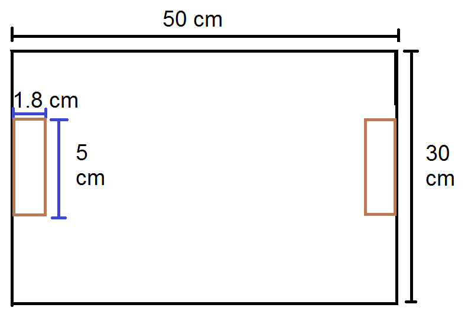
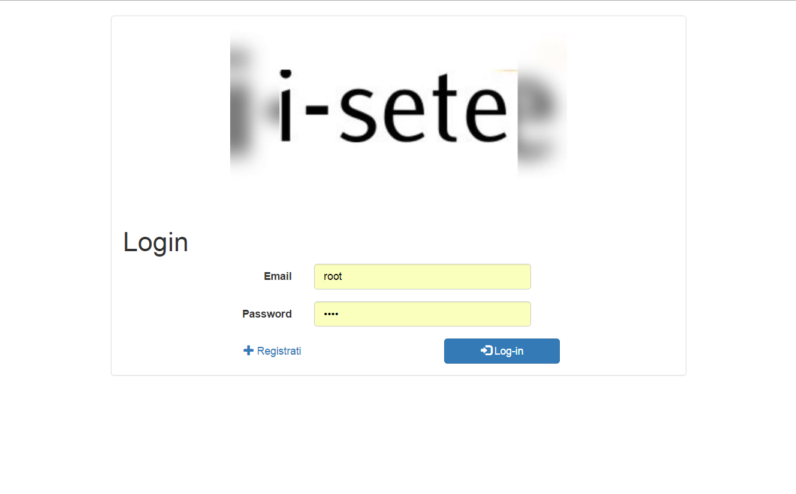

# iSete


1. [Introduzione](#introduzione)

  - [Informazioni sul progetto](#informazioni-sul-progetto)

  - [Abstract](#abstract)

  - [Scopo](#scopo)

1. [Analisi](#analisi)

  - [Analisi del dominio](#analisi-del-dominio)

  - [Analisi e specifica dei requisiti](#analisi-e-specifica-dei-requisiti)

1. [Use case](#use-case)

  - [Pianificazione](#pianificazione)

  - [Analisi dei mezzi](#analisi-dei-mezzi)

1. [Progettazione](#progettazione)

  - [Design dell’architettura del sistema](#design-dell’architettura-del-sistema)

  - [Design dei dati e database](#design-dei-dati-e-database)

1. [Implementazione](#implementazione)

1. [Test](#test)

  - [Protocollo di test](#protocollo-di-test)

  - [Risultati test](#risultati-test)

  - [Mancanze/limitazioni conosciute](#mancanze/limitazioni-conosciute)

1. [Consuntivo](#consuntivo)

1. [Conclusioni](#conclusioni)

  - [Sviluppi futuri](#sviluppi-futuri)

  - [Considerazioni personali](#considerazioni-personali)

1. [Sitografia](#sitografia)

1. [Allegati](#allegati)


## Introduzione

### Informazioni sul progetto


  Scuola: SAMT - Scuola Arti e Mestieri Trevano
  Sezione: Informatica
  Matera: Progetti

  Allievi:
  - Ettore Ongaro
  - Andrea Lupica
  - Raffaele Scarcella
  - Nishan Anthonippillai
  - Serhiy Ushchapivskyy

Docente responsabile
  - Luca Muggiasca

Data di inizio: 03.02.2016

Data di consegna: 11.05.2016

<!--

  In questo capitolo raccogliere le informazioni relative al progetto, ad esempio:

  -   Allievo/i e docente/i coinvolti nel progetto e rispettivi ruoli,

  -   scuola ,sezione, materia/e,

  -   date di inizio e termine di consegna,

  -   …
  -->


### Abstract

<!--

  E’ una breve e accurata rappresentazione dei contenuti di un documento,
  senza notazioni critiche o valutazioni. Lo scopo di un abstract efficace
  dovrebbe essere quello di far conoscere all’utente il contenuto di base
  di un documento e metterlo nella condizione di decidere se risponde ai
  suoi interessi e se è opportuno il ricorso al documento originale.

  Può contenere alcuni o tutti gli elementi seguenti:

  -   **Background/Situazione iniziale**

  -   **Descrizione del problema e motivazione**: Che problema ho cercato
      di risolvere? Questa sezione dovrebbe includere l'importanza del
      vostro lavoro, la difficoltà dell'area e l'effetto che potrebbe
      avere se portato a termine con successo.

  -   **Approccio/Metodi**: Come ho ottenuto dei progressi? Come ho
      risolto il problema (tecniche…)? Quale è stata l’entità del mio
      lavoro? Che fattori importanti controllo, ignoro o misuro?

  -   **Risultati**: Quale è la risposta? Quali sono i risultati? Quanto è
      più veloce, più sicuro, più economico o in qualche altro aspetto
      migliore di altri prodotti/soluzioni?

  Esempio di abstract:

  > *As the size and complexity of today’s most modern computer chips
  > increase, new techniques must be developed to effectively design and
  > create Very Large Scale Integration chips quickly. For this project, a
  > new type of hardware compiler is created. This hardware compiler will
  > read a C++ program, and physically design a suitable microprocessor
  > intended for running that specific program. With this new and powerful
  > compiler, it is possible to design anything from a small adder, to a
  > microprocessor with millions of transistors. Designing new computer
  > chips, such as the Pentium 4, can require dozens of engineers and
  > months of time. With the help of this compiler, a single person could
  > design such a large-scale microprocessor in just weeks.*

-->
_Do you need a coffee but you don't have with for buy it? Don't worry: with the new dispenser you can buy every type of coffee pod trought your account!
You just have to log in, add your credit to your account and you can buy coffee pod when you want, everywhere you are.
With the new dispenser you could buy coffee pod from your phone without go to the coffe maker !
What are you waiting for? Take your preferred coffee pod!_

### Scopo

<!--
  Lo scopo del progetto (scopi didattici/scopi operativi). Dovrebbe
  descrivere il mandato, ma non vanno ricopiate le informazioni del
  quaderno dei compiti (che va invece allegato).
-->
  Lo scopo principale del progetto è quello di realizzare un sistema di
  gestione e acquisto per le capsule del caffé.

  Questo sistema viene utilizzato principalmente da tre tipologie di utenti:
  - Amministratore: ha il pieno controllo del sistema
  - Responsabile: si occupa della gestione dei crediti e degli utenti
  - Utente generico: acquista le capsule e consulta il suo credito e storico
    degli acquisti

Vi è un sito del prodotto dove il cliente tramite la postazione fisica oppure
tramite un applicazione android può acquistare le capsule.
Il responsabile si collega al sito per visualizzare le statistiche riguardanti
gli utenti e le capsule e per ricaricare il saldo.

<!-- sezione non finita -->

## Analisi

### Analisi del dominio

<!--
  Questo capitolo dovrebbe descrivere il contesto in cui il prodotto verrà
  utilizzato, da questa analisi dovrebbero scaturire le risposte a quesiti
  quali ad esempio:

  -   Background/Situazione iniziale

  -   Quale è e come è organizzato il contesto in cui il prodotto dovrà
      funzionare?

  -   Come viene risolto attualmente il problema? Esiste già un prodotto
      simile?

  -   Chi sono gli utenti? Che bisogni hanno? Come e dove lavorano?

  -   Che competenze/conoscenze/cultura posseggono gli utenti in relazione
      con il problema?

  -   Esistono convenzioni/standard applicati nel dominio?

  -   Che conoscenze teoriche bisogna avere/acquisire per poter operare
      efficacemente nel dominio?

  -   …
-->
Al momento coloro che usufruiscono della macchinetta del caffé sono solo i docenti.
Non esiste nulla di simile al momento, chi vuole usare la macchinetta del caffé deve comprarsi le proprie capsule.
Per utilizzare questo prodotto non bisogna avere competenze particolari.


### Analisi e specifica dei requisiti


|ID |REQ-001                                       |
|---|------------------------------------------------|
|**Nome**    |Struttura hardware |
|**Priorità**|1                     |
|**Versione**|1.0                   |
|            |**Sotto requisiti** |
|**001**      |Deve essere modulabile.  |
|**002**      |Deve essere riempito con le capsule.|
|**003**      |Il ricaricamento deve essere facilitato, senza compromettere il funzionamento della struttura.                  |
|**004**      |Deve avere un metodo di espulsione delle capsule a dipendenza della scelta effettuata.|
|**006**      |Deve comunicare al server gli acquisti.|
|**007**      |Le capsule devono essere gestite da un servomotore controllato dall’Arduino.|


|ID |REQ-002                                       |
|---|------------------------------------------------|
|**Nome**    |Riconoscimento |
|**Priorità**|1                     |
|**Versione**|1.0                   |
|            |**Sotto requisiti** |
|**001**      |Deve essere presente un metodo di riconoscimento univoco dell’utente per chi vuole usufruire dell’apparecchio.  |
|**002**      |Bisogna avere una server dove memorizzare gli utenti.|
|**003**      |In caso di server down, bisogna avere un riconoscimento locale.                 |
|**004**      |In caso di server down, bisogna avere un metodo di memorizzazione temporaneo in locale.|

|ID |REQ-003                                       |
|---|--------------------------------------------------------|
|**Nome**    |Amministratore |
|**Priorità**|1                     |
|**Versione**|1.0                   |
|            |**Sotto requisiti** |
|**001**      |Amministratore gestisce il sito.  |
|**002**      |Deve poter dare permessi.|
|**003**      |Deve poter aggiungere i moduli.        |

|ID |REQ-004                                       |
|---|------------------------------------------------|
|**Nome**    |Responsabile |
|**Priorità**|1                     |
|**Versione**|1.0                   |
|            |**Sotto requisiti** |
|**001**      |Si preoccupa della gestione dei crediti di ogni singolo utente.  |
|**002**      |Ricaricare il distributore di capsule. |
|**003**      |Avere la possibilità di creare utenti.    |
|**004**      |Deve poter gestire gli utenti.|
|**005**      |Deve poter creare i grafici dei acquisti.|
|**006**      |Deve poter caricare credito agli utenti.|
|**007**      |Dovrà avere la possibilità di vedere le capsule vendute.|

|ID |REQ-005                                      |
|---|--------------------------------------------------------|
|**Nome**    |Utente comune |
|**Priorità**|1                     |
|**Versione**|1.0                   |
|            |**Sotto requisiti** |
|**001**      |Ogni utente deve poter consultare il proprio credito.  |
|**002**      |Ha a disposizione informazioni riguardanti i propri acquisti quali storico e quantità di capsule.|

|ID |REQ-006                                     |
|---|--------------------------------------------------------|
|**Nome**    |Raspberry |
|**Priorità**|1                     |
|**Versione**|1.0                   |
|            |**Sotto requisiti** |
|**001**      |Hosta un sito che permette la gestione del prodotto: utenti, capsule, configurazioni |
|**002**      |Comunica con altri dispositivi|
|**003**      |Comunica con componenti esterni|


### Use case


### Pianificazione
<!--
Prima di stabilire una pianificazione bisogna avere almeno una vaga idea
del modello di sviluppo che si intende adottare. In questa sezione
bisognerà inserire il modello concettuale di sviluppo che si seguirà
durante il progetto. Gli elementi di riferimento per una buona
pianificazione derivano da una scomposizione top-down della problematica
del progetto.

La pianificazione può essere rappresentata mediante un diagramma di
Gantt.

Se si usano altri metodi di pianificazione (es scrum), dovranno apparire
in questo capitolo.
-->
### Analisi dei mezzi
<!--
Elencare e *descrivere* i mezzi disponibili per la realizzazione del
progetto. Ricordarsi di sempre descrivere nel dettaglio le versioni e il
modello di riferimento.

SDK, librerie, tools utilizzati per la realizzazione del progetto e
eventuali dipendenze.

Su quale piattaforma dovrà essere eseguito il prodotto? Che hardware
particolare è coinvolto nel progetto? Che particolarità e limitazioni
presenta? Che hw sarà disponibile durante lo sviluppo?
-->
#### Software
- Apache 2.4.10
- MySQL 5.5.44-0+deb8u1
- PHP 5.6.17-0+deb8u1
- Android Studio 2.0
- Raspbian 8.0
- API Google Chart
- Bootstrap 3.3.6
- JQuery 1.12.0
- JDK Java 1.8.0_65
- libreria jdbc (mysql connector)
- libreria gpio (servo motore)

#### Hardware
- Attrezzi presenti nell'aula di modellismo
- Cartone
- Legno
- Cartone
- Servo motore
- Raspberry
- Capsule del caffè
- Tablet

## Progettazione
<!--
Questo capitolo descrive esaustivamente come deve essere realizzato il
prodotto fin nei suoi dettagli. Una buona progettazione permette
all’esecutore di evitare fraintendimenti e imprecisioni
nell’implementazione del prodotto.
-->

### Design dell’architettura del sistema
<!--
Descrive:

-   La struttura del programma/sistema lo schema di rete...

-   Gli oggetti/moduli/componenti che lo compongono.

-   I flussi di informazione in ingresso ed in uscita e le
    relative elaborazioni. Può utilizzare *diagrammi di flusso dei
    dati* (DFD).

-   Eventuale sitemap
-->
### Design dei dati e database
<!--
Descrizione delle strutture di dati utilizzate dal programma in base
agli attributi e le relazioni degli oggetti in uso.
-->
<!--
Se il diagramma E-R viene modificato, sulla doc dovrà apparire l’ultima
versione, mentre le vecchie saranno sui diari.
-->


### Web Server

#### Sitoweb

##### Login(Ettore & Usha)

La pagina di login, dovrebbe diventare qualcosa di simile
all'immagine sottostante.


Da cui si accede, poi alla pagina richiesta.
Vorremo fare anche in modo che ci sia un bottone anche per potersi registrare al sito.


##### Richiesta (Ettore & Usha)
La pagina richiesta abbiamo deciso di farla in questo modo


Come si può notare, vi sono delle zone tratteggiate. Esse, sono delle "idee temporanee"
da sviluppare in maniera migliore in fase di implementazione.


##### Pagina di configurazione(Raffaele)

Ho pensato di fare la pagina di configurazione nel seguente modo:

un titolo in alto alla pagina, una tabella centrale che contiene i record, tre bottoni rispettivamente per aggiungere, rimuovere e modificare le configurazioni.


##### Gestione capsule (Raffaele)

La pagina dovrebbe essere strutturata nel seguente modo:

un titolo in alto alla pagina, una tabella centrale che contiene i record, tre bottoni rispettivamente per aggiungere, rimuovere e modificare le capsule.


##### Pagina Statistiche (Raffaele)
Per quanto riguarda la pagina di statistiche per il responsabile, ho pensato
di svilupparla con un titolo in alto, con delle tabelle contenenti delle
statistiche che in seguito vengono rappresentati attraverso dei grafici.


##### Gestione utenti(Nishan)
Ho progettato una pagina molto semplice con una tabella chiara con le informazioni neccessarie e ho anche inserito dei campi per gestire la tabella.

All'inizio della pagina chiedo le informazione base per aggiungere utenti e rimuoverli.

Per aggiungere un utente chiedo di inserire nome, cognome, credito e password. Deve essere obbligatorio mettere tutti i dati. Per rimuovere l'utente basta inserire nome e cognome.


##### Storico acquisti(Nishan)
Ho progettato una pagina molto semplice con una tabella chiara con le informazioni neccessarie.

Questa pagina è visible solamente agli utenti che sono registrati e, tramite la connessione al database, faccio vedere
tutti gli acquisti.


#### Applicazione Android(Raffaele)
L'applicazione Android ho pensato di farla semplicemente tramite una
webview permettendo così di utilizzare unicamente il sito e renderlo responsive
su qualunque smartphone android.

### HW

#### Gestione (Andrea & Serhiy)
Per la memorizzazione offline e il collegamento ethernet abbiamo inizialmente deciso di usare Arduino, ma a causa di troppi problemi riscontrati abbiamo deciso di usare Raspberry.
Abbiamo deciso di fare uno codice in java che, a dipendenza di quante capsule venivano scelte, faceva girare un servo motore (a dipendenza della capsula scelta) n volte.

#### Struttura (Nishan & Raffaele)
Per la struttura abbiamo pensato ad una superificie da attaccare al muro sulla quale posizionare dei separatori per le capsule.
Le capsule saranno visibili poichè si userà del plexiglass come materiale per la facciata frontale.

Uno schizzo fatto alla lavagna con qualche misura annotata.


Progettazione dall'alto del dispenser con misure più nel dettaglio:

- 1) Materiale che andrà attaccato alla parete.
Dimensioni: 50x30x1 centimetri.
- 2) Materiale che avrà la funziona di separatore tra le diverse colonne di capsule.
Dimensioni: 1x25x3 centimetri in modo da contenere una decina di capsule e avere lo spazio per creare un'unica via d'uscita.
- 3) Plexiglass per fare in modo di poter vedere le capsule all'interno del dispenser.
Dimensioni: 6.5x25x0.3 centimetri per poter ricoprire tutta la lunghezza dei separatori.
- 4) Materiale che servirà per avere un spazio tra il muro e la base dove poter posizionare il Raspberry e il cablaggio per collegare gli altri componenti.
Dimensioni: 1.8x15x5 centimetri.


Vista da dietro del dispenser:


Per quanto riguarda la posizione dei servo motori praticheremo dei fori alla base dove inserirceli dentro.


#### Espulsione capsule (Nishan & Raffaele)
Per quanto riguarda l'espulsione delle capsule abbiamo pensato di far ruotare le capsule usando il metodo a ferro di cavallo.

Il servo motore avrà attaccata un'elica che a sua volta sarà collegata al "ferro di cavallo" per farlo girare.
Con questo metodo si riesce a prendere una capsula alla volta, poichè grazie alla rotazione del contenitore si chiude lo spazio per una seconda capsula.


## Implementazione

<!--
In questo capitolo dovrà essere mostrato come è stato realizzato il
lavoro. Questa parte può differenziarsi dalla progettazione in quanto il
risultato ottenuto non per forza può essere come era stato progettato.

Sulla base di queste informazioni il lavoro svolto dovrà essere
riproducibile.

In questa parte è richiesto l’inserimento di codice sorgente/print
screen di maschere solamente per quei passaggi particolarmente
significativi e/o critici.

Inoltre dovranno essere descritte eventuali varianti di soluzione o
scelte di prodotti con motivazione delle scelte.

Non deve apparire nessuna forma di guida d’uso di librerie o di
componenti utilizzati. Eventualmente questa va allegata.

Per eventuali dettagli si possono inserire riferimenti ai diari.
-->


### Web Server

#### Sitoweb

###### Premessa

La pagina di richiesta ingloberà tutte le altre pagine di ipotetico interesse dell'utente
(quindi storico, configurazione (per responsabile), gestione utenti (per responsabile), ...).
Questa scelta è stata adottata, in parte per via di consigli di terze parti ma anche perché permetteva
una maggiore elasticità di inserimento di elementi aggiuntivi (riferimenti esterni in generale).

##### Gestione utenti (Nishan)
###### Aggiungi utente
Per svolgere questa pagina ho usato Boostrap.
Per chiedere il credito ho inserito un campo number value, per la mail ho usato una funzione di controllo che ha usato Ettore per il login. Quando si inserisce la password e le inserisco nel database le codifico con la una funzione che si chiama .md5. Poi tramite una funzione controllo se le due password sono uguali.
Con questo if controllo se tutti i campi sono completati.
```
if(!empty($nome) && !empty($cognome) && !empty($credito) && !empty($password)){
  ```

Questo è il risultato di come appare la nostra finestra aggiungi utenti.


###### Rimuovi utente
Per rimuovere un utente basta inserire l'email dell'utente.


La pagina risultante è questa.


##### Gestione credito (Nishan)
Con questo modulo posso gestire il credito massimo che si puo avere. Poi come ho detto in precedenza, quando inserisco un nuovo utente controllo che il credito iniziale sia minore uguale al massimo.


##### Storico utente (Nishan)
Questa pagina mostra le capsule prese dall'utente. Quando l'utente accede prendo il nome utente e uso quello per mostrare lo storico.


##### Login(Ettore)

Per la creazione del login, ho deciso di formare il tutto con l'ausilio degli elementi Bootstrap
dedicati principalmente ai form, ma non solo: ho deciso di fare in modo che il tutto fosse "avvolto" in un pannello,
rendendo l'intera pagina di Login comprente solo una parte dell'intero schermo. Ho addottato questa decisione, perché
buona parte dei login che si possono trovarer in giro hanno uno "standard di visualizzazione" e volevo provare
ad imitarlo. Per rendere anche più intuitivo il tutto, ho deciso di utilizzare le Glyphicon, una serie
di icone standardizzate implementate da Bootstrap.



##### Richiesta (Ettore)

Nella pagina di richiesta sono presenti univocamente i due input che si riferiscono al tipo e al quantitativo di capsule.
Per finire, i grafici e le opzioni verranno implementate in modo differente dall'aspettato.


##### Sezione configurazione(Raffaele)

La sezione è configurata in modo da avere una tabella centrale con sopra tre bottoni per le funzionalità: aggiungi, rimuovi e modifica.


La tabella è strutturata nel seguente modo:
```
<?php while($row = sess("db")->fetch($tmp)){ ?>
	<tr>
		<td><?php echo $row["co_nome"];?></td>
		<td><?php echo $row["co_valore"];?></td>
		<td><?php echo $row["co_descrizione"];?></td>
	</tr>
<?php }
```

###### Aggiungi configurazione

Quando si clicca il bottone "Aggiungi configurazione" uscirà un popup in cui viene richiesto il nome, il valore
e una descrizione.


Una volta confermata l'aggiunta, il sito si reindirizza ad un'altra pagina che aggiunge la configurazione al database:
```
$nome = $_POST['nome'];
$valore = $_POST['valore'];
$descrizione = $_POST['descrizione'];
sess("db")->start();
if(!empty($nome) && !empty($valore)){
	$ret = sess("db")->query("INSERT INTO configurazione (co_nome, co_valore, co_descrizione)
	VALUES ('".$nome."', '".$valore."', '".$descrizione."');");
	if($ret){
		echo "Configurazione aggiunta correttamente";
	}else{
		echo "Configurazione già presente";
	}
}
```

###### Modifica configurazione

Quando si clica il bottone "Modifica configurazione" uscirà un popup dove si deve scegliere tramite un menù la configurazione, il suo nuovo valore ed un eventuale descrizione.


Una volta confermata la modifica, il sito si reindirizza ad un'altra pagina che modifica la configurazione nel database:
```
$nome = $_POST['nome'];
$valore = $_POST['valore'];
$descrizione = $_POST['descrizione'];
sess("db")->start();
if(!empty($nome) && !empty($valore) && isset($descrizione)){
	$ret = sess("db")->query("UPDATE configurazione SET co_nome = '$nome', co_valore = '$valore',
	co_descrizione = '$descrizione' WHERE co_nome = '$nome';");
	if($ret){
		echo "Aggiornamento configurazione effettuato";
	}
	else{
		echo "Errore imprevisto";
	}
}
```
###### Elimina Configurazione

Quando si clicca il bottone "Rimuovi configurazione" uscirà uscirà un popup dove si deve scegliere tramite un menü la configurazione da rimuovere.


Una volta confermata l'eliminazione, il sito si reindirizza ad un'altra pagina che elimina la configurazione nel database:
```
$nome = $_POST['nome'];
sess("db")->start();
if(!empty($nome)){
	$ret = sess("db")->query("DELETE FROM configurazione WHERE co_nome='$nome'");
	if($ret){
		echo "Configurazione rimossa correttamente";
	}
	else{
		echo "Configurazione non trovata";
	}
}
```

##### Pagina Statistiche(Raffaele)

#### Applicazione Android(Raffaele)
Con la seguente riga di codice abilito l'applicazione alla navigazione in internet.
```
<uses-permission android:name="android.permission.INTERNET"/>
```
Mentre con quest'altra riga di codice abilito l'applicazione a ricavare informazioni sullo stato di rete.
```
<uses-permission android:name="android.permission.ACCESS_NETWORK_STATE"/>
```
Con questo pezzo di codice, nella classe java dell'applicazione, nel metodo onCreate ricavo lo stato della rete tramite le classi ConnectivityManager e NetworkInfo.
Successivamente controllo che l'applicazione sia connessa alla rete e informo tramite un toast(popup) l'esito sia positivo che negativo.
In caso di esito positivo creo la webview e la reindirizzo, tramite il metodo loadUrl, al sito desiderato.
```java
 @Override
    protected void onCreate(Bundle savedInstanceState) {
        super.onCreate(savedInstanceState);
        setContentView(R.layout.activity_main);

        ConnectivityManager cManager = (ConnectivityManager) getSystemService(this.CONNECTIVITY_SERVICE);
        NetworkInfo nInfo = cManager.getActiveNetworkInfo();
        if(nInfo!= null && nInfo.isConnected()){
            Toast.makeText(this,"Connessione a internet disponibile",Toast.LENGTH_LONG).show();


            WebView webView = (WebView)findViewById(R.id.webView);
            webView.setWebViewClient(new WebViewClient());
            webView.getSettings().setJavaScriptEnabled(true);
            webView.setVerticalScrollBarEnabled(false);
            webView.setHorizontalScrollBarEnabled(false);
            webView.loadUrl("192.168.1.253");
        }
        else{
            Toast.makeText(this,"Connessione a internet non disponibile",Toast.LENGTH_LONG).show();
        }
    }
```
### HW

#### Struttura legno(Nishan)

Come si vede nell'immagine sottostante ho messo due pezzi di legno di spessore 1 cm.
Questi due distano 4.8 cm.
Alla base ho messo 5 strati di cartone che formano 5 centimentri in modo che la capsula cada nel ferro di cavallo


Il legno che funge da corridoio per le capsule sono alte 4 centimetri.
Sopra questo metteremo un plexiglass in modo che si veda il colore della capsula ma nessuno li potrà toccare.


Per mettere il servo motore ho fatto il buco e poi ho fatto un buco di mezzo centimetro cosi entra tutta la struttura e rimane fuori solamente l'elica.


Questo sarà il nostro sostegno, andrà dietro alla struttura con lo spessore in mezzo in modo che mettiamo in mezzo la breadboard.


#### Espulsione capsule(Andrea)

##### Schema Logico

##### Codice
Per far funzionare il servo motore con il Raspberry ho cercato uno script che mi permettesse la connessione fra Servo motore e Raspberry, dopodiché, per farlo funzionare, ho dovuto installare la libreria GPIO seguendo  [la seguente guida](http://pi4j.com/install.html)
Dopodiché ho implementato la classe funzionante in modo tale che il codice potesse essere usato anche con l'aumento di tipi di capsule. Per fare ciò ho dovuto collegarmi al database tramite java e per fare ciò ho dovuto usare la classe [jdbc](https://dev.mysql.com/downloads/connector/j/3.1.html). Ho creato un codice che, passando due parametri come argomenti della classe, che equivalgono al numero delle capsule e al tipo delle capsule, mi facciano girare il servo motore, corrispondente al tipo della capsula, un numero di volte equivalte al primo parametro passato.
```java
    public static void main(String[] args) {
        ServoMotoreModulare s = new ServoMotoreModulare(Integer.parseInt(args[0]), args[1]);
    }
```
Per fare ciò ho creato dei metodi che richiamo nel costruttore.
```java

    public ServoMotoreModulare(int n, String t) { // costruttore
        this.connected(); // connessione al db
        this.setTypeCapsula(t); // settaggio del pin
        this.rotation(n); // rotazione del servo motore
    }
```
tramite this.connected() faccio la connessione al db.
con il metodo setTypeCapsula() cerco prima nell'array la posizione in cui si trova quel tipo di capsula, dopodiché uso quella posizione per inizalizzare il servo motore dove la posizione nell'array dei pin è uguale a quella dell'array delle capsule

```java
    public void setTypeCapsula(String tipo) { // tipo della capsula
        int p = nomiCapsule.indexOf(tipo); // mi ritorna la posizione dove value=tipo
        myServo = gpio.provisionDigitalOutputPin(pinRasp[p], // pin del servo motore corrispondente
                "My LED", // PIN FRIENDLY NAME (optional)
                PinState.LOW);;
    }
```
infine con il metodo this.rotation() realizzo un for che mi faccia girare il servo motore inizalizzato in precedenza n volte.

#### Memorizzazione(Serhiy)


## Test

### Protocollo di test
<!--
Definire in modo accurato tutti i test che devono essere realizzati per
garantire l’adempimento delle richieste formulate nei requisiti. I test
fungono da garanzia di qualità del prodotto. Ogni test deve essere
ripetibile alle stesse condizioni.


|Test Case      | TC-001                               |
|---------------|--------------------------------------|
|**Nome**       |Import a card, but not shown with the GUI |
|**Riferimento**|REQ-012                               |
|**Descrizione**|Import a card with KIC, KID and KIK keys with no obfuscation, but not shown with the GUI |
|**Prerequisiti**|Store on local PC: Profile\_1.2.001.xml (appendix n\_n) and Cards\_1.2.001.txt (appendix n\_n) |
|**Procedura**     | - Go to “Cards manager” menu, in main page click “Import Profiles” link, Select the “1.2.001.xml” file, Import the Profile - Go to “Cards manager” menu, in main page click “Import Cards” link, Select the “1.2.001.txt” file, Delete the cards, Select the “1.2.001.txt” file, Import the cards |
|**Risultati attesi** |Keys visible in the DB (OtaCardKey) but not visible in the GUI (Card details) |
-->

|Test Case       | TC-001                               |
|----------------|--------------------------------------|
|**Nome**        |Input form del sito|
|**Riferimento** |REQ-006|
|**Descrizione** |Andare ad inserire in ogni campo di ogni form del sito valori che dovrebbe accettere e quelli che non dovrebbe accettare.|
|**Prerequisiti**|Sito funzionante.|
|**Procedura**   |Testare ogni campo di ogni form del sito, inserendo dati non ammessi come spazio, caratteri diversi da numeri e lettere oppure inserire parole dove viene richiesto un numero.|
|**Risultati attesi** |Vedi allegato: test.xlsx|
|**Risultati ottenuti** |Vedi allegato: test.xlsx|

|Test Case       | TC-002                              |
|----------------|--------------------------------------|
|**Nome**        |Output form del sito|
|**Riferimento** |REQ-003, REQ-004, REQ-005, REQ-006|
|**Descrizione** |Verificare il risultato a dipendenza dei privilegi dell'utente loggato.|
|**Prerequisiti**|Sito funzionante e dati input validi|
|**Procedura**   |Verificare nelle tabelle del sito e nelle tabelle del database il risultato delle richieste effettuate a dipendenza dei privilegi dell'utente loggato.|
|**Risultati attesi** |Vedi allegato: test.xlsx|
|**Risultati ottenuti** |Vedi allegato: test.xlsx|

|Test Case       | TC-003                               |
|----------------|--------------------------------------|
|**Nome**        |Hardware|
|**Riferimento** |REQ-001|
|**Descrizione** |Verificare che la struttura sia modulabile, possa essere riempita facilmente e comunicare con un servo motore per l'espulsione delle capsule|
|**Prerequisiti**|Sito e hardware funzionanti|
|**Procedura**   |-Provare ad aumentare la quantità di capsule contenute
-controllare che sia facile da riempire
-verificare che si riesca a comunicare con il servo motore|
|**Risultati attesi** |La struttura sarà modulabile, potrà essere riempita facilmente con il server e comunicherà con il servo motore per poter espellere le capsule. Vedi anche allegato: test.xlsx|
|**Risultati ottenuti** |La struttura non è modulabile, può essere riempita facilmente e comunica con il servo motore se e solo la distanza tra la base della struttura è del plexiglass è di almeno 4.3 centimetri. Vedi anche allegato: test.xlsx|

|Test Case       | TC-004                               |
|----------------|--------------------------------------|
|**Nome**        |Riconoscimento|
|**Riferimento** |REQ-002|
|**Descrizione** |Verificare che ci si possa riconoscere per usufruire del prodotto, anche in caso di server down|
|**Prerequisiti**|Sito funzionante|
|**Procedura**   |Collegarsi con un computer o con uno smartphone/tablet al sito e provare a loggare.|
|**Risultati attesi** |Si verrà riconosciuti, anche in caso di server down|
|**Risultati ottenuti** |Si viene riconosciuti, in caso di server down non ci si può connettere|

### Risultati test
<!--
Tabella riassuntiva in cui si inseriscono i test riusciti e non del
prodotto finale. Se un test non riesce e viene corretto l’errore, questo
dovrà risultare nel documento finale come riuscito (la procedura della
correzione apparirà nel diario), altrimenti dovrà essere descritto
l’errore con eventuali ipotesi di correzione.
-->
### Mancanze/limitazioni conosciute

- Non è modulabile (o difficilmente modulabile) la parte hardware

- Un po' lento nell'attuazione della richiesta

- Misurazioni errate per lo spazio delle capsule tra l'area di base e il plexiglass

<!--
Descrizione con motivazione di eventuali elementi mancanti o non
completamente implementati, al di fuori dei test case. Non devono essere
riportati gli errori e i problemi riscontrati e poi risolti durante il
progetto.
-->
## Consuntivo
<!--
Consuntivo del tempo di lavoro effettivo e considerazioni riguardo le
differenze rispetto alla pianificazione (cap 1.7) (ad esempio Gannt
consuntivo).
-->

Durante lo sviluppo del progetto, vi sono stati vari cambiamenti dall'idea di partenza:

- **dal utilizzare l'Arduino al Raspberry**
	principalmente, è stato fatto questo cambiamento, perché ci serviva un sistema efficente per la comunicazione in parallello con un
	sistema di memorizazzione e via ethernet. Dato che arduino questa funzionalità la gestiva in modo inutilizzabile, poco pratico, per
	ciò di cui avevamo bisogno, abbiamo adottato la scelta di utilizzare comunque una sorta di micro-controllore, ma "nato" per riuscire
	a gestire al meglio questa, apparentemente insignificante, particolarità.

- **design sito e multi-pagina a mono pagina**
	fare il sito monopagina è una scelta è avvenuta grazie anche ad un consiglio offertoci da un nostro professore. In effetti, ultimamente, le applicazioni, o pagine,
	web tendono a fare tutto ciò di cui si ha bisogno su un'univoca pagina, per fare in modo che su qualsiasi dispositivo sia facilmente utilizzabile
	senza troppi problemi. Questa scelta non ha mancato di portarci problemi, ma con la giusta determinazione e testardaggine, siamo comunque più
	soddisfatti del risultato. Inoltre, durante lo sviluppo vi sono stati parecchi cambiamenti
  riguardanti le pagine web, tentando di migliorarle sempre di più.

- **approccio diretto con iSete**
	per quanto riguarda i metodi per poter comunicare direttamente (senza bisogno di dispositivi esterni, intendesi) con il nostro sistema, vi sono
	stati una grande quantità di cambiamenti o supposizioni. Tra riconoscimenti di vario genere (QR Code, carta, codice identificativo) e metodi di
	iterazione (solo schermo, schermo e tastierino numerico, eccetera), siamo arrivati alla conclusione di utilizzare un dispositivo che ci desse
	abbastanza libertà di scelta: un tablet. Non sarà stata la via più semplice, ma quella più conveniente di sicuro.

- **struttura hardware**
	la struttura hardware ha avuto leggere modifiche riguradante le misure che essa avrebbe dovuto avere. Il nostro più grande collo di bottiglia era
	avere a disposizione un officina per poter creare questa struttura, dato che necessitavamo di docenti specifici (quindi in mancanza di essi non
	si poteva proseguire). Inoltre, non essendo degli esperti nel settore di laborazione di materiali, in alcuni casi ha portato anche dei rallentamenti.

## Conclusioni

Questo progetto è un idea alternativa alle macchinette da caffé, potrebbe essere molto interessante
in caso che non si voglia avere molte macchinette da caffe sparse per una determinata zona, ma avere un ritrovo
per tutte le capsule desiderate. L'ipotesi, però, che esso diventi un oggetto comune non è totalmente da scartare,
tutto dipende dai bisogni di ogni singolo utente, giustamente. Inoltre, permette un punto d'accesso univoco
indipendentemente dall'utente che vi accede, il che può essere un fattore molto comodo.

<!--
Quali sono le implicazioni della mia soluzione? Che impatto avrà?
Cambierà il mondo? È un successo importante? È solo un’aggiunta
marginale o è semplicemente servita per scoprire che questo percorso è
stato una perdita di tempo? I risultati ottenuti sono generali,
facilmente generalizzabili o sono specifici di un caso particolare? ecc
-->
### Sviluppi futuri

- Il nostro modello hardware non è stato progettato con l'intento di diventare direttamente modulabile. Quindi, uno sviluppo futuro potrebbe essere il re-design della struttura in modo da renderla più facilmente
modulabile.

- Si potrebbe fare in modo che faccia cadere direttamente la capsula in una macchinetta la quale faccia il caffé.

- Struttura finale di come pensavamo di farla


<!--
  Migliorie o estensioni che possono essere sviluppate sul prodotto.
-->
### Considerazioni personali
#### Nishan
Per me, questo è la seconda esperienza in un progetto di gruppo ma gestito in modo diverso.
Quest'anno abbiamo usato droptask per dividerci il lavoro e secondo me è stata una bella
idea ma anche contemporaneamente utile perchè in questo modo potevi sempre sapere cosa c'era da
fare e cosa mancava. Mi è piaciuto il progetto perchè ho potuto lavorare un po sul sito e sull'hardware.
In conclusione volevo anche dire che questo progetto facendolo in massimo 5 persone era piu produttivo
e coinvolgieva tutti in modo attivo.

#### Raffaele
Come per Nishan, questo è il mio secondo progetto di gruppo. Quest'anno invece del solito modello a cascata abbiamo utilizzato la metodologia SCRUM. È stato interessante perchè è stato qualcosa di nuovo e potenzialmente utile in futuro.
Nonostante avessimo un gran carico di lavoro siamo riusciti a gestirlo abbastanza bene con questo metodo poichè ogni 2 settimane si faceva il punto della situazione mettendo nuovi paletti da seguire.
È stato utile perchè a differenza di un gantt classico il programma poteva cambiare, anche drasticamente, dando nuove priorità.
<!--
  Cosa ho imparato in questo progetto? ecc
-->

### Sitografia

- [W3Schools](http://www.w3schools.com)
- [PI4J](http://www.pi4j.com)
- [API Google Chart](https://developers.google.com/chart)

<!--
1.  URL del sito (se troppo lungo solo dominio, evt completo nel
    diario),

2.  Eventuale titolo della pagina (in italico),

3.  Data di consultazione (GG-MM-AAAA).

**Esempio:**

-   http://standards.ieee.org/guides/style/section7.html, *IEEE
    Standards Style Manual*, 07-06-2008.
-->

## Allegati
<!--
Elenco degli allegati, esempio:

-   Diari di lavoro

-   Codici sorgente/documentazione macchine virtuali

-   Istruzioni di installazione del prodotto (con credenziali
    di accesso) e/o di eventuali prodotti terzi

-   Documentazione di prodotti di terzi

-   Eventuali guide utente / Manuali di utilizzo

-   Mandato e/o Qdc

-   Prodotto

-   …
-->

- QDC

- Diari di lavoro

- Test Form

- Prodotto
