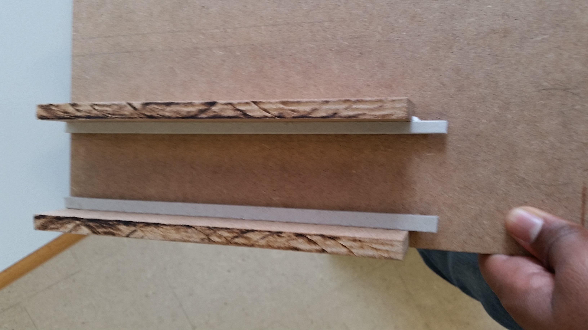
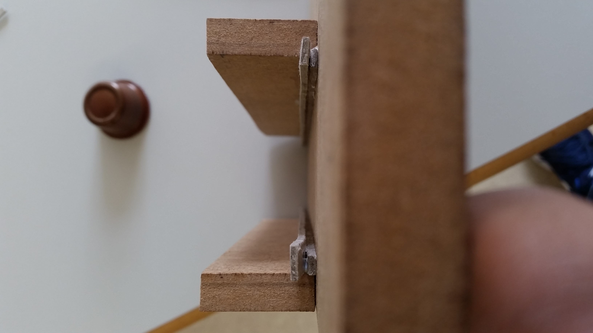

# iSete | Diario di lavoro - 06.04.2016
##### N. Anthonippillai, E. Ongaro, R. Scarcella, A. Lupica, S. Ushchapivskyy
### Canobbio, 06.04.2016

## Lavori svolti
#####Ettore

#####Andrea

#####Raffaele

Insieme a Nishan ho lavorato all'implementazione della struttura hardware del
dispenser.
Abbiamo pensato di usare del legno per realizzare la base attaccata alla
parete e i separatori che dividono le colonne di capsule.
Invece per tenere ferme le capsule abbiamo pensato di usare dei pezzi in
cartone per non complicarci troppo il lavoro.
Nella tarda mattinata, dopo aver tagliato il cartone e il legno in aula
di modellistica con l'aiuto del capolaboratorio dei disegnatori Cesare
Casale, abbiamo incollato alla base i primi due separatori.
In seguito ho lavorato alla documentazione aggiungendo la parte di implementazione dell'applicazione android.

#####Nishan

Come ha scritto Raffaele nella sua parte, abbiamo tagliato tutti i pezzi e per fare le canaline
abbiamo utilizzato cartone e incollato il tutto con la colla calda
il Risultato:

#####Serhiy

##  Problemi riscontrati e soluzioni adottate
#####Ettore

#####Andrea

#####Serhiy

#####Raffaele

##  Punto della situazione rispetto alla pianificazione

## Programma di massima per la prossima giornata di lavoro
